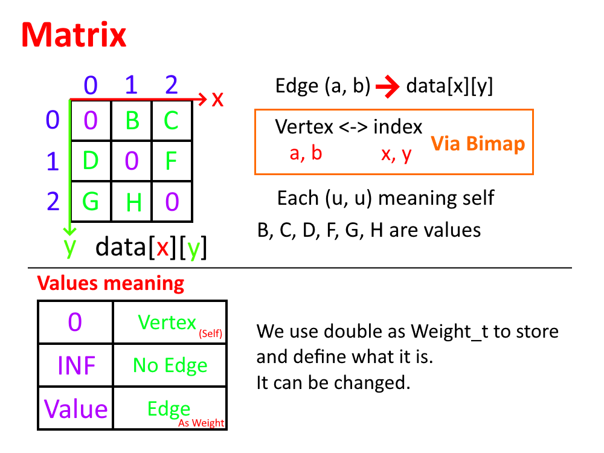
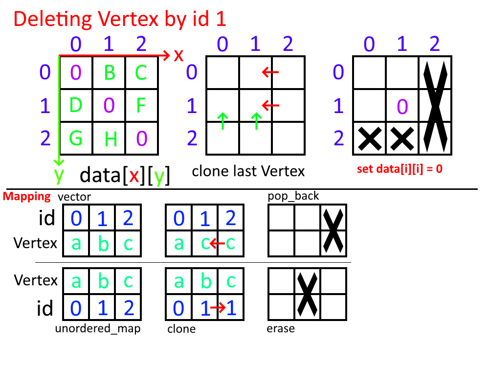

# 41343131

# 41343129

作業二

## 解題說明

題目說明提到了大量關於Graph的ADT與各種methods，不過不確定需要實作到哪種程度故所見即作。
原先的設計是透過純粹的繼承方式，但於實作過程中意識到其實有更多的內容是重複性的，因此改用模板與`constexpr`。

題目本身有著大量關於Graph的methods，但沒有嚴格限制實作方法，因此設計components配合template達到目的。

最一開始是照著說明使用繼承方式，但在途中注意到有大量重複與類似結構、方法，因此修改為這種新的方式。

在這種方法中

## 程式實作

在Matrix中，我們這樣設計儲存方式：



在Matrix中，刪除一個頂點，同時顧及vector特性，我們先將最後一項複製到待刪除的位置，隨後將最後一項刪除(`vector::pop_back()`)，同時修改自身邊及id/value map。



本次 `Graph.h` :

```h
#ifndef GRAPH_H
#define GRAPH_H
#define LL long long
#define ID_t size_t

// allow getDFS(Vertext v) and getBFS(Vertex v) that v NOT includes in Graph
// disable it if you want NOT allow call with a NOT existing Vertex
#define ALLOW_FS_START_FROM_NOT_EXISTS

// all #includes
#include <type_traits>
#include <exception>
#include <stdexcept>
#include <optional>
#include <functional>
#include <vector>
#include <stack>
#include <queue>
#include <unordered_map>
#include <unordered_set>
#include <algorithm>
#include <limits>
#include <cmath>


namespace yGraph {  // namespace yGraph


using Vertex = int;
// if use others not double, have to figure out with "INF" problem
using Weight_t = double;
// is weight infinity
inline constexpr bool is_inf(Weight_t w) noexcept { return std::isinf(w); };
inline constexpr Weight_t get_inf() noexcept { return std::numeric_limits<Weight_t>::infinity(); };
using Order_t = size_t;

struct Edge {
    Vertex u, v;
    Weight_t weight = 0.0;

    bool operator<(const Edge& that) const {
        return this->weight < that.weight;
    }
    bool operator>(const Edge& that) const {
        return this->weight > that.weight;
    }
};


// DFS results (for analyze)
typedef struct {
    // sequence of Vertices (i -> Vertex) | [ Vertex... ]
    std::vector<Vertex> order;

    // order of each Vertex (Vertex -> order) | { Vertex : Order_t... }
    std::unordered_map<Vertex, Order_t> dfn;

    // earliest reachability (closest to root) | { Vertex : Order_t... }
    std::unordered_map<Vertex, Order_t> low_link;

    // each Vertices' parent | { Vertext : Vertex... }
    std::unordered_map<Vertex, Vertex> parent;
    // each Vertices' childrens | { Vertext : [ Vertex... ]... }
    std::unordered_map<Vertex, std::vector<Vertex>> children;
    // std::unordered_map<Vertex, std::unordered_set<Vertex>> not better

    // articulation points | { Vertex... }
    std::unordered_set<Vertex> articulation_points;
    // using in Undirection-Graph only

    // connected components | [ [ Vertex... ]... ]
    std::vector<std::vector<Vertex>> components;
    // for Undirected-Graph

    // BCC | [ [ Edge... ]... ]
    std::vector<std::vector<Edge>> bcc_edges;
    // for Undirected-Graph

    // SCC
    // for Directed-Graph

    // spanning trees (allowed forest)
    std::vector<Edge> tree_edges;            // T
    // std::vector<Edge> none_tree_edges; // N
} DFS_Result;

typedef struct {
    // sequence of Vertices (i -> Vertex) | [ Vertex... ]
    std::vector<Vertex> order;

    // order of each Vertex (Vertex -> order) | { Vertex : Order_t... }
    std::unordered_map<Vertex, Order_t> bfn;

    // each Vertices' parent | { Vertext : Vertex... }
    // std::unordered_map<Vertex, Vertex> parent;
    // each Vertices' childrens | { Vertext : [ Vertex... ]... }
    // std::unordered_map<Vertex, std::vector<Vertex>> children;
} BFS_Result;

namespace {     // namespace null

struct FS_callback {
    void operator()(Vertex, Vertex, Vertex) const {};
};

};          // namespace null

// COMPONENTS | EMPTY
// struct Empty { };
// # TO DO REMOVE Empty; force all Edges have weight

// COMPONENTS | directed ?
struct Direction {
    struct Directed { static constexpr bool is_directed = true; };
    struct Undirected { static constexpr bool is_directed = false; };
};

// COMPONENTS | weight ?
// template <typename T = double>
struct Weight {
    struct Type {
        // using ValueType = T;
        static constexpr bool is_weight = true;
    };
    struct None {
        // using ValueType = Empty;
        static constexpr bool is_weight = false;
    };
};

// COMPONENTS | storage ...
template <typename WeightType, typename Is_Directed>
struct Storage {
    struct Linked {             // LinkedList
        // static constexpr bool is_weight = WeighType::is_weight;
        // using Weight_t = WeightType::ValueType;
        using NB_t = std::conditional_t<    // V -> nb鄰居
            WeightType::is_weight,   // ?:
            std::unordered_map<Vertex, Weight_t>,   // { V : W }
            std::unordered_set<Vertex>                      // { V... }
        >;

        //
        // data

        // { Vertex : { Vertex : Weight_t... }... } / { Vertex : { Vertex... } }
        std::unordered_map<Vertex, NB_t> data;
        size_t e = 0;                       // numbers of edges


        //
        // func | helper
        template<typename T>
        static Vertex get_npos(const T& item) {
if constexpr (WeightType::is_weight)
            return item.first;
else
            return item;
        };

        Edge get_edge(const Vertex& pos, const Vertex& npos) { // , const Weight_t& w // auto get
if constexpr (WeightType::is_weight) {         // weight
            return Edge{pos, npos, data.at(pos).at(npos)};
} else {                                                          // non-weight
            return Edge{pos, npos};
}
        };


        //
        // func | getter

        // return true if graph has no vertices
        bool is_empty() const { return !data.size(); };

        // return number of vertices in the graph
        size_t number_of_vertices() const { return data.size(); };

        // return number of edges in the graph
        size_t number_of_edges() const { return e; };

        // return number of edges incident to vertex u
        size_t degree(Vertex u) const {
            auto the = data.find(u);
            if (the == data.end()) return 0;
if constexpr (Is_Directed::is_directed) {       // IF
            size_t t = the->second.size();
            for (const auto& pair : data) {
                t += pair.second.count(u); // set::contains // C20
            }
            return t;
} else {                                                          // ELSE
            return the->second.size();
}
        };

        // return true if graph has the edge (u, v)
        bool exists_edge(Vertex u, Vertex v) const {
            auto the = data.find(u);
            if (the == data.end()) return false;
            else return the->second.count(v);
        };

        // get all edges in Graph
        std::vector<Edge> getEdges() const {
            std::vector<Edge> edges;
            for (auto const& [pos, nbs] : data) {
                for (auto const& item : nbs) {
                    Vertex npos = get_npos(item);
                    if constexpr (!Is_Directed::is_directed) if (pos > npos) continue;
                    edges.push_back(get_edge(pos, npos));
                }
            }
            return edges;
        };

        //
        // func | modify

        // insert vertex v into graph; v has no incident edges
        void insert_vertex(Vertex v) {
if constexpr (WeightType::is_weight) {       // IF
            data.emplace(v, std::unordered_map<Vertex, Weight_t>{});
} else {                                                       // ELSE
            data.emplace(v, std::unordered_set<Vertex>{});
}
        };

        // insert edge (u, v) into graph
        void insert_edge(Vertex u, Vertex v, Weight_t w = Weight_t{}) {
            if (u == v) throw std::invalid_argument("(v, v) is illegal");  // if make it possible, must fix the logic
            insert_vertex(u);    // possible no exists  // could be disappeared, bc data[u] is able to auto-insert
            insert_vertex(v);    // possible no exists
            if (!data[u].count(v)) ++e;

            // helper func
            auto add_edge = [&](Vertex from, Vertex to, Weight_t weight) {
if constexpr (WeightType::is_weight)
                data[from][to] = weight;
else
                data[from].insert(to);
            };

            add_edge(u, v, w);
if constexpr (!Is_Directed::is_directed) {     // IFN
            add_edge(v, u, w);
}
/*
else {                                                       // ELSE
if constexpr (WeightType::is_weight) {                        // IF
data[u][v] = w;
data[v][u] = w;
} else {                                                                         //ELSE
data[u].insert(v);
data[v].insert(u);
}
}
*/
        };

        // delete v and all edges incident to it
        void delete_vertex(Vertex v) {
            auto the = data.find(v);
            if (the == data.end()) return;

            // edges part
if constexpr (Is_Directed::is_directed) {                           // IF
            for (auto& [_, sec] : data) if (sec.erase(v)) --e;
} else {                                                                              // ELSE
            for (const auto& it : the->second) data.at(it).erase(v);
}

            // vertices part
            e -= the->second.size();
            data.erase(v);
        };

        // delete edge (u, v) from the graph
        void delete_edge(Vertex u, Vertex v) {
            auto the = data.find(u);
            if (the == data.end()) return;
            if (the->second.erase(v)) {
if constexpr (!Is_Directed::is_directed) {      // IF
                data.at(v).erase(u); // data[v].erase(u);
}
                --e;
            }
        };


        //
        // algorithm

        // #TODO move to namespace, not in Graph/Storage class/struct anymore
        DFS_Result getDFS(Vertex start) const {
            if (is_empty()) return {};

            // start from NOT exists
            if (data.find(start) == data.end())
#ifndef ALLOW_FS_START_FROM_NOT_EXISTS
                return {};                               // END
                // or throw Error
#else
                start = data.begin()->first;    // get a RND one
#endif

            DFS_Result res; // save result
            res.components.emplace_back();  // for save [[]]
            std::vector<Vertex>* components_ptr = &res.components.back();
            Order_t counter = 0;
            std::unordered_set<Vertex> on_stack;
            // determine that in a chain from parent, not from other chain
            // stack for SCC ? // std::stack<Vertex> stk;

            // bcc used for undirected Graph
            /*
            using bcc_stack_t = std::conditional_t<
            WeightType::is_weight,
            WEdge<Weight_t>,
            Edge
            >;
            */
            std::stack<Edge> bcc_stack;

            // res.dfn => visited ? { Vertex : Order_t }


            // resolved //~~ # TO DO NOT WORK in all instances~~
            // rec function
            std::function<void(Vertex, std::optional<Vertex>)> rec  // REC BEGIN ==== ==== |
            = [&](Vertex pos, std::optional<Vertex> par) {  // par = std::nullopt
                on_stack.insert(pos);                // BEGIN stack

                // if (!res.dfn.count(pos)) // always true
                components_ptr->push_back(pos); // components

                // order
                res.order.push_back(pos);
                res.dfn[pos] = res.low_link[pos] = counter;
                ++counter;
                
                size_t children_counting = 0;
                auto const& the = data.at(pos);
                for (auto const& item : the) {                          // FOR BEGIN ==== ==== |
                    const Vertex npos = get_npos(item);
if constexpr (!Is_Directed::is_directed) {  // undirected
                    // in undirected case, bypass direct-parent
                    if (par.has_value() && par.value() == npos) continue;
}
                    // iterate all childrens
                    auto const& dfn_npos = res.dfn.find(npos);
                    if (dfn_npos == res.dfn.end()) {      // never visited | #### #### | #### #### |

                        res.parent[npos] = pos;
                        res.children[pos].push_back(npos);
                        ++children_counting;        //

                        Edge e = get_edge(pos, npos);
                        res.tree_edges.push_back(e);            // spanning tree (forest)
if constexpr (!Is_Directed::is_directed) {  // undirected
                        bcc_stack.push(e);
    /*
    if constexpr (WeightType::is_weight) {         // weight
                        Edge e = Edge{pos, npos, data.at(pos).at(npos)};
                        res.tree_edges.push_back(e); // tree
                        bcc_stack.push(e);
    } else {                                                          // non-weight
                        Edge e = Edge{pos, npos};
                        res.tree_edges.push_back(e); // tree
                        bcc_stack.push(e);
    }
    */
}
                        //
                        //                                                // CALL recursive | BEGIN
                        rec(npos, pos);
                        //                                                // END recursive
                        //
                        res.low_link[pos] = std::min(
                            res.low_link[pos],
                            res.low_link[npos]
                        );                                      // update low-link

                        //
                        // # TO DO #HERE undi
                        // if never visited, push Edge{u, v}
                        // after rec(u,v) (u -> v)
                        // if low(v) >= dfn(u) meaning exist bcc
                        // start pushing from bcc_stack
                        // until edge {u, v}

if constexpr (!Is_Directed::is_directed) {  // undirected
                        // if (u != start && low[v] >= dfn[u])
                        // BCC
                        if (res.low_link.at(npos) >= res.dfn.at(pos)) {
                            if (par.has_value()) res.articulation_points.insert(pos);
                            std::vector<Edge> bcc_tmp;
                            while (true) {  // popping
                                auto edge = bcc_stack.top();
                                bcc_stack.pop();
                                bcc_tmp.push_back(edge);
                                if (
                                    (edge.u == pos && edge.v == npos) ||
                                    (edge.u == npos && edge.v == pos)
                                ) break;
                            }
                            res.bcc_edges.push_back(bcc_tmp);
                        }
                        // if (par.has_value() && res.low_link.at(npos) >= res.dfn.at(pos))
                            // res.articulation_points.insert(pos);
}

                    } else {                           // been visited | #### #### | #### #### |

if constexpr (Is_Directed::is_directed) {   // directed
                        if (on_stack.count(npos)) {
                            // AND is in current DFS stack
                            // (pos -> npos) is a back-edge
                            if (res.dfn[npos] < res.dfn[pos]) res.low_link[pos] = std::min(
                                res.low_link[pos],
                                res.dfn[npos]
                            );
                        }
} else {                                                      // undirected
                        res.low_link[pos] = std::min(
                            res.low_link[pos],
                            res.dfn[npos]
                        );

                        if (res.dfn[npos] < res.dfn[pos]) {
                            bcc_stack.push(get_edge(pos, npos));
                            /*
                            if constexpr (WeightType::is_weight) {
                                bcc_stack.push(Edge{pos, npos, data.at(pos).at(npos)});
                            } else {
                                bcc_stack.push(Edge{pos, npos});
                            }
                            */
                        }
}

                    }   // NOT in current DFS stack // else { }
                }
if constexpr (!Is_Directed::is_directed) {  // root articulation points
                if (!par.has_value() && children_counting > 1) res.articulation_points.insert(pos);
}
                on_stack.erase(pos);                // END stack
            };                                                          // END REC
            // exe
            rec(start, std::nullopt);
            for (auto const& v : data) {
                // for isolated => forest
                if (!res.dfn.count(v.first)) {
                    res.components.emplace_back();
                    components_ptr = &res.components.back();
                    rec(v.first, std::nullopt);
                }
            }
            return res;
        };


        BFS_Result getBFS(Vertex start) const {
            if (is_empty()) return {};

            // start from NOT exists
            if (data.find(start) == data.end())
#ifndef ALLOW_FS_START_FROM_NOT_EXISTS
                return {};                               // END
#else
                start = data.begin()->first;    // get a RND one
#endif
            BFS_Result res;
            Order_t counter = 0;
            // res.bfn -> visited

            // in queueing
            std::queue<Vertex> queueing;
            const auto q_push = [&](const Vertex& p) {
                queueing.push(p);
                res.order.push_back(p);
                res.bfn[p] = counter;   // is a visited mark same time
                ++counter;
            };

            // queueing.push(start);
            q_push(start);
            
            while (!queueing.empty()) {
                Vertex pos = queueing.front();
                queueing.pop();
                // res.order.push_back(pos);
                // res.bfn.insert(pos, counter);
                // ++counter;

                for (auto const& next : data.at(pos)) {
                    Vertex npos = get_npos(next);
                    if (res.bfn.count(npos)) continue;
                    q_push(npos);
                };
            }

            return res;
        };
/*
DFS_Result DiLinkedGraph::getDFS() const {
    if (is_empty()) return {};
    else return getDFS(data.begin()->first);
}
// you should call this function with the DFS result
std::vector<std::vector<Vertex>> const DiLinkedGraph::getCComponents() const {
    return getDFS().components;
};
*/

    };
    struct Matrix {
        static constexpr bool is_weight = WeightType::is_weight;
        // using Weight_t = WeightType::ValueType;

        // using id
        std::vector<std::vector<Weight_t>> data;    // [ [ w ] ] | [u][v] = w;
        std::unordered_map<Vertex, ID_t> id;  // { Vertex : id } | v -> id
        std::vector<Vertex> vid;                        // { id : Vertex }  | id -> v

        size_t e = 0;   // numbers of edges

        //
        // func | helper

        //
        // func | getter

        // return true if graph has no vertices
        bool is_empty() const { return !data.size(); };

        // return number of vertices in the graph
        size_t number_of_vertices() const { return data.size(); };

        // return number of edges in the graph
        size_t number_of_edges() const { return e; };

        // return number of edges incident to vertex u
        size_t degree(Vertex u) const {
            // #TODO degree matrix
        };

        // return true if graph has the edge (u, v)
        bool exists_edge(Vertex u, Vertex v) const {
            if (u == v) return false;
            if ((!id.count(u)) || (!id.count(v))) return false;
            const ID_t pos = id.at(u);
            const ID_t npos = id.at(v);
            if (is_inf(data[pos][npos])) return false;
            else return true;
        };
        bool exists_edge(Edge e) const { return exists_edge(e.u, e.v); };

        // get all edges in Graph
        std::vector<Edge> getEdges() const {
            std::vector<Edge> edges;
            // for (auto const& [column, rows] : data) {
            for (size_t i_c = 0; i_c < data.size(); ++i_c) {
                /* column means col_id ; row means row_id
                // rows is not real rows, it is a [ ] in [ ]
                * c c c c
                r x x x X
                r x x x X
                r x x x X
                r x x x X
                c, r are id
                X are in same [ ]
                */
                Vertex pos = vid[i_c];
                // for (auto const& [row, weight] : rows) {
                for (size_t i_r = 0; i_r < data.size(); ++i_r) {
                    Vertex npos = vid[i_r];
                    if (pos == npos) continue;      // self edge
                    Weight_t weight = data[i_c][i_r];
                    if (is_inf(weight)) continue;       // edge not exists
                    if constexpr (!Is_Directed::is_directed) if (pos > npos) continue;
                    edges.push_back({pos, npos, weight});
                }
            }
            return edges;
        };

        //
        // func | modify
        
        // insert vertex v into graph; v has no incident edges
        void insert_vertex(Vertex v) {
            if (id.count(v)) return;    // already exists
            const ID_t i = data.size();
            id.insert({v, i});  // start from index 0
            vid.push_back(v);
            const Weight_t inf_w = get_inf();
            for (auto& rows : data) {
                rows.push_back(inf_w);
            }
            data.emplace_back(i+1, inf_w);
        };

        // insert edge (u, v) into graph
        void insert_edge(Vertex u, Vertex v, Weight_t w = Weight_t{}) {
            if (u == v) throw std::invalid_argument("(v, v) is illegal");  // if make it possible, must fix the logic
            insert_vertex(u);    // possible no exists
            insert_vertex(v);    // possible no exists

            const ID_t pos = id.at(u);
            const ID_t npos = id.at(v);
            if (is_inf(data[pos][npos])) ++e;
            data[pos][npos] = w;
if constexpr (!Is_Directed::is_directed)
            data[npos][pos] = w;
        }
        
        // delete v and all edges incident to it
        void delete_vertex(Vertex v) {
            // find it -> change as last -> pop &&-> set [i][i] = INF &&-> update id and vid
            auto it = id.find(v);   // it->second == be d id
            if (it == id.end()) return;  // not exists
            const Vertex lv = vid.back();  // last v
            for (size_t i = 0; i + 1 < data.size(); ++i) {  // bypass last one
                if (!is_inf(data[it->second][i])) --e;
if constexpr (Is_Directed::is_directed)
                if (!is_inf(data[i][it->second])) --e;
                data[it->second][i] = data[data.size() - 1][i];
                data[i][it->second] = data[i][data.size() - 1];
                data[i].pop_back();
            }
            data.pop_back();
            // id vid
            vid[it->second] = lv; // id -> v
            id[lv] = it->second; // v -> id
            id.erase(it);
            vid.pop_back();
        };

        // delete edge (u, v) from the graph
        void delete_edge(Vertex u, Vertex v) {
            if ((!id.count(u)) || (!id.count(v))) return; // a Vertex not exists => edge impossible exists
            const ID_t pos = id.at(u);
            const ID_t npos = id.at(v);
            if (is_inf(data[pos][npos])) return;         // edge not exists
            data[pos][npos] = get_inf();
if constexpr (!Is_Directed::is_directed)
            data[npos][pos] = get_inf();
            --e;
        };
    };
    // #TODO fix matrix data[i][i] = INF problem in Floyd-Warshall case
};


// virtual basic class | for pointer using only
class Graph {
    /**
     * @property a non-empty set of vertices and a set of undirected edges.
     * where each edge is a pair of vertices.
     */
public:
    virtual ~Graph() {};
    // destructor

    //
    // getter

    virtual bool is_empty() const = 0;
    // return true if graph has no vertices

    virtual size_t number_of_vertices() const = 0;
    // return number of vertices in the graph

    virtual size_t number_of_edges() const = 0;
    // return number of edges in the graph

    virtual size_t degree(Vertex u) const = 0;
    // return number of edges incident to vertex u

    virtual bool exists_edge(Vertex u, Vertex v) const = 0;
    // return true if graph has the edge (u, v)

    virtual std::vector<Edge> getEdges() const = 0;

    //
    // modify-type

    virtual void insert_vertex(Vertex v) = 0;
    // insert vertex v into graph; v has no incident edges

    virtual void insert_edge(Vertex u, Vertex v) = 0;
    // insert edge (u, v) into graph

    virtual void insert_edge(Vertex u, Vertex v, Weight_t w) = 0;
    // insert edge (u, v) (weight) into graph

    virtual void insert_edge(Edge e) = 0;

    virtual void delete_vertex(Vertex v) = 0;
    // delete v and all edges incident to it

    virtual void delete_edge(Vertex u, Vertex v) = 0;
    // delete edge (u, v) from the graph

    //
    // algorithm

    // get Depth-First Search
    virtual DFS_Result getDFS(Vertex start) const = 0;
    virtual DFS_Result getDFS() const = 0;
    
    // get Breadth-First Search
    virtual BFS_Result getBFS(Vertex start) const = 0;
    virtual BFS_Result getBFS() const = 0;

    // get Connected Components
    virtual std::vector<std::vector<Vertex>> const getCComponents(const DFS_Result &dfs) const {
        return dfs.components;
    };
    // you should call this function with the DFS result
    virtual std::vector<std::vector<Vertex>> const getCComponents() const {
        return getDFS().components;
    };

    // get Spanning Tree (return a Forest is possible)
    virtual std::vector<Edge> const getSpanningTree(const DFS_Result& dfs) const {
        return dfs.tree_edges;
    };
    // you should call this function with the DFS result
    virtual std::vector<Edge> const getSpanningTree() const {
        return getDFS().tree_edges;
    };

    // get Biconnected Components
    virtual std::vector<std::vector<Edge>> getBCComponents(const DFS_Result &dfs) const = 0;

protected:
    // size_t n;                      // number of vertices
    // size_t e;                      // number of edges
};

template <typename Storage_P>
class BasicGraph : public Graph {
private:
    Storage_P storage;
public:

    //
    // getter
    bool is_empty() const override { return storage.is_empty(); };
    size_t number_of_vertices() const override { return storage.number_of_vertices(); };
    size_t number_of_edges() const override { return storage.number_of_edges(); };
    size_t degree(Vertex u) const override { return storage.degree(u); };
    bool exists_edge(Vertex u, Vertex v) const override { return storage.exists_edge(u, v); };

    std::vector<Edge> getEdges() const override { return storage.getEdges(); };

    //
    // modify

    void insert_vertex(Vertex v) override { storage.insert_vertex(v); };
    void insert_edge(Vertex u, Vertex v) override {
        storage.insert_edge(u, v);
    };
    void insert_edge(Vertex u, Vertex v, Weight_t w) override {
        storage.insert_edge(u, v, w);
    };
    void insert_edge(Edge e) override {
        storage.insert_edge(e.u, e.v, e.weight);
    };
    void delete_vertex(Vertex v) override { storage.delete_vertex(v); };
    void delete_edge(Vertex u, Vertex v) override { storage.delete_edge(u, v); };

    //
    // algorithm
    // #TODO move algorithm from Graph class to namespace,
    // it should not be a member function
    // splice getDFS to DFS with a callback to collect data

    // get DFS
    DFS_Result getDFS(Vertex start) const override {
        return storage.getDFS(start);
    };
    DFS_Result getDFS() const override {
        if (is_empty()) return {};
        return getDFS(storage.data.begin()->first);
    };

    // get BFS
    BFS_Result getBFS(Vertex start) const override {
        return storage.getBFS(start);
    };
    BFS_Result getBFS() const override {
        if (is_empty()) return {};
        return getBFS(storage.data.begin()->first);
    };
    
    std::vector<std::vector<Edge>> getBCComponents(const DFS_Result& dfs) const override { return dfs.bcc_edges; };
    std::unordered_set<Vertex> getArticulationPoints(const DFS_Result& dfs) {
        return dfs.articulation_points;
    };
};

//
// classes

using DiLinkedGraph = BasicGraph<Storage<Weight::None, Direction::Directed>::Linked>;
using UndiLinkedGraph = BasicGraph<Storage<Weight::None, Direction::Undirected>::Linked>;
using WDiLinkedGraph = BasicGraph<Storage<Weight::Type, Direction::Directed>::Linked>;
using WUndiLinkedGraph = BasicGraph<Storage<Weight::Type, Direction::Undirected>::Linked>;

using WDiMatrixGraph = BasicGraph<Storage<Weight::Type, Direction::Directed>::Matrix>;
using DiMatrixGraph = BasicGraph<Storage<Weight::Type, Direction::Directed>::Matrix>;
using WUndiMatrixGraph = BasicGraph<Storage<Weight::None, Direction::Undirected>::Matrix>;
using UndiMatrixGraph = BasicGraph<Storage<Weight::None, Direction::Undirected>::Matrix>;


//
// algorithm
// #TODO

template<typename TGraph,
                typename F = FS_callback,
                typename std::enable_if<std::is_base_of_v<Graph, TGraph>, int>::type = 0>
// requires std::derived_from<TGraph, Graph>;
DFS_Result getDFS(
    const TGraph& graph,
    const Vertex start,
    const F& callback = FS_callback{}
    // const std::function<void(Vertex, Vertex, Vertex)>& callback
) {
    // #TODO DFS is a friend with Graph(storage)
};

// disjoint set union
class DSU {
private:
    std::unordered_map<Vertex, Vertex> data;

public:
    // dsu get
    Vertex find(Vertex v) {
        if (!data.count(v))
            return data[v] = v;
        if (data[v] == v)
            return v;
        return data[v] = find(data[v]);
    }

    // a hack method
    bool unite(Vertex u, Vertex v) {
        u = find(u);
        v = find(v);

        if (u == v) return false;

        data[v] = u;
        return true;
    };
    bool unite(Edge e) {
        return unite(e.u, e.v);
    };
};

// matrix type not found #TODO
WUndiLinkedGraph getMST_K(const WUndiLinkedGraph& graph) {
    WUndiLinkedGraph res;
    std::vector<Edge> edges = graph.getEdges();
    std::sort(edges.begin(), edges.end()); // <
    DSU dsu;

    for (const Edge& edge : edges) {
        if (dsu.unite(edge))
            res.insert_edge(edge);
    }

    return res;
};

}; // namespace yGraph
#endif // GRAPH_H

```

## 效能分析

因為本次使用了 `std::unordered_map` 與 `std::unordered_set` 這些在底層實作是使用hash的方式儲存key:value，因此理論的存取與查找時間複雜度為 $O(1)$ 這是我選用他們的原因，而且在定義上Graph的邊或點並沒有"順序"可言，因此unordered是個好主意。

| 操作 | 複雜度 |
| - | - |
| `insert_edge()` | $O(1)$ |
| `insert_edge()` | $O(1)$ |
| `insert_edge()` | $O(1)$ |

## 測試與驗證
為了驗證圖形 ADT 運算以及走訪演算法（特別是 Tarjan 雙連通分量演算法與關節點計算）的正確性，我們設計了三種不同結構的圖形進行測試。

1. 測試案例一：無向圖形架構 (Undirected Graph)這個圖形主要用來測試無向圖中的橋（Bridge）與關節點（Articulation Point）。頂點 4 連接了上方的環狀結構與下方的孤立點 5，因此在拓撲結構上屬於關鍵節點。
    頂點集合 (V)： $\{1, 2, 3, 4, 5\}$
    邊集合 (E)： $\{(1, 2), (2, 3), (3, 4), (4, 1), (4, 5)\}$
    結構特性： 頂點 4 為關節點；移除邊 $(4, 5)$ 會使圖形不連通，故 $(4, 5)$ 為橋。
2. 測試案例二：有向圖形架構 (Directed Graph)這個圖形主要用來驗證有向圖下的 DFS 走訪順序與強連通分量（SCC）。其中的 1、2、3、4 四個頂點構成了一個順時針的有向環（Directed Cycle），而頂點 5 則是只能單向到達的終端節點。
頂點集合 (V)： $\{1, 2, 3, 4, 5\}$
邊集合 (E)： $\{(1, 2), (2, 3), (3, 4), (4, 1), (4, 5)\}$
結構特性： 子圖 $\{1, 2, 3, 4\}$ 互為可達，構成一個強連通分量；頂點 5 出度（Out-degree）為 0。

## 效能量測

請參見 [效能分析](#效能分析)

## 心得討論

在設計過程中，我更換過最一開始的設計理念，將資料部分分離製作成storage，但後面越做越偏，最後才注意到似乎將演算法等都塞進了storage，這是個待修正的問題。

在透過大量template的方法中其實遇到了不少問題，途中也修改了多次。
還上網找尋了很多資料，最有印象的是很特別的`std::conditional_t`他竟然允許透過一個`bool`決定資料類型，這其實蠻有趣的。

我也應該將Storage的工作徹底分離，而不再模糊於存取與演算法。

## 申論及開發報告

為了能夠使用Graph*指標的方式來存取與操作子類Graph成員，
我設計了
Graph

^ BasicGraph-(在這裡決定使用了哪些述詞)

其中包含 Storage

在設計中各子類能透過父類別Graph的指標進行正確的操作。

這是預期的。

在Linked Graph中，很適合稀疏圖(Sparse Graph)，
另外的Matrix則是很適合邊的查找，但缺點也顯而易見，她消耗的空間太大了。

目前的設計還有很多的、很大的進步空間，例如實現DFS的callback功能。
